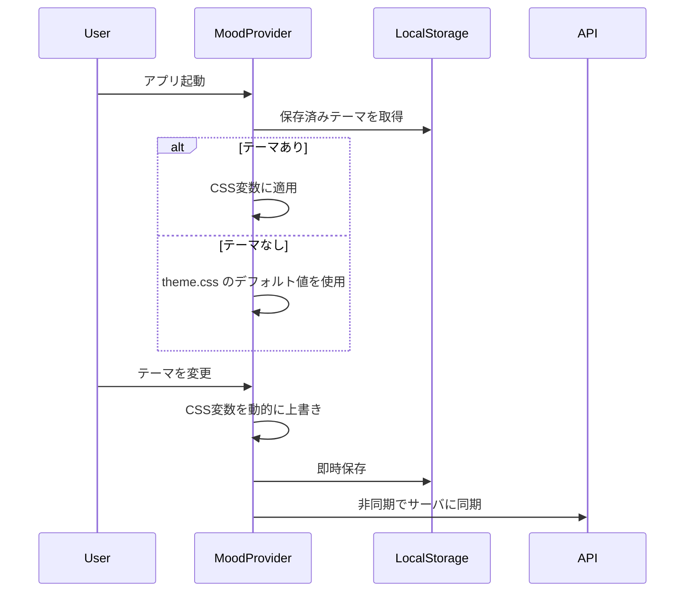

# Mood — テーマ・外観管理モジュール

このフォルダは、アプリケーションの**外観（テーマ）に関する設定**を一元管理するためのモジュールです。  
「Mood」＝ アプリの "雰囲気" を表し、フォント・カラー・ダークモードなどの視覚的な設定を扱います。

---

## 現在のファイル構成

```
src/mood/
├── README.md        ← このドキュメント
└── theme.css        ← デザイントークン（CSS変数: フォント・カラー）
```

---

## デザイントークン一覧

### フォント

| 変数名 | 説明 | デフォルト値 |
|---|---|---|
| `--font-sans` | 本文用フォント | Inter, Noto Sans JP, system-ui |
| `--font-mono` | コード用フォント | JetBrains Mono, ui-monospace |

### カラー（Light / Dark 両モード定義）

| 変数名 | 用途 | Tailwindクラス例 |
|---|---|---|
| `--background` | ページ背景 | `bg-background` |
| `--foreground` | メインテキスト | `text-foreground` |
| `--primary` | ブランドカラー | `bg-primary`, `text-primary` |
| `--secondary` | サブカラー | `bg-secondary` |
| `--muted` | 控えめな背景 | `bg-muted` |
| `--muted-foreground` | 補助テキスト | `text-muted-foreground` |
| `--border` | ボーダー | `border-border` |
| `--input` | フォーム入力枠 | `border-input` |
| `--ring` | フォーカスリング | `ring-ring` |
| `--destructive` | エラー・削除 | `text-destructive` |
| `--success` | 成功 | `text-success` |
| `--warning` | 警告 | `text-warning` |
| `--info` | 情報 | `text-info` |
| `--radius` | 角丸のベース値 | `rounded-md` |

---

## 将来の拡張計画: ユーザーカスタムテーマ

### 目的

ユーザーがアプリの外観（フォント・カラー）を自分好みにカスタマイズし、その設定を永続化できるようにする。

### データモデル案

```typescript
type MoodPreset = {
  id: string;                    // プリセットID (uuid or slug)
  name: string;                  // "ダーク＆グリーン", "シンプルモノクロ" など
  fontSans: string;              // '--font-sans' の値
  fontMono: string;              // '--font-mono' の値
  colors: {
    light: Record<string, string>; // { background: '0 0% 100%', primary: '200 98% 39%', ... }
    dark: Record<string, string>;  // ダークモード用の色
  };
  createdAt: string;
  updatedAt: string;
};
```

### 保存先の候補

| 方式 | メリット | デメリット | 適用シーン |
|---|---|---|---|
| **localStorage** | 実装が簡単、サーバ不要 | デバイス間で同期不可、容量制限 | MVP・個人利用 |
| **DB（サーバ）** | デバイス間同期、バックアップ可能 | API実装が必要 | マルチデバイス対応 |
| **両方（ハイブリッド）** | オフライン対応＋同期 | 競合解決が必要 | プロダクション |

### 実装イメージ

```
src/mood/
├── README.md              ← このドキュメント
├── theme.css              ← デフォルトテーマ（フォールバック用CSS）
├── tokens.ts              ← [将来] CSS変数キーの定数定義・型定義
├── presets.ts             ← [将来] ビルトインのプリセットテーマ
├── useMood.ts             ← [将来] テーマの読み書きを行うカスタムフック
└── MoodProvider.tsx       ← [将来] テーマをContextで提供するProvider
```

### 適用フロー（予定）



### CSS変数の動的適用（技術メモ）

```typescript
// CSS変数をJSから動的に上書きする例
function applyMoodTokens(tokens: Record<string, string>) {
  const root = document.documentElement;
  for (const [key, value] of Object.entries(tokens)) {
    root.style.setProperty(`--${key}`, value);
  }
}

// リセット（theme.cssのデフォルトに戻す）
function resetMoodTokens(keys: string[]) {
  const root = document.documentElement;
  for (const key of keys) {
    root.style.removeProperty(`--${key}`);
  }
}
```

---

## 既存コードとの関係

- `tailwind.config.js` — CSS変数をTailwindユーティリティにマッピング
- `src/index.css` — `@import './mood/theme.css'` でデフォルトテーマを読み込み
- `src/ui/ThemeProvider.tsx` — ダークモード切替（`.dark`クラスのトグル）
- 将来の`MoodProvider`は`ThemeProvider`と統合 or 並列で使用
